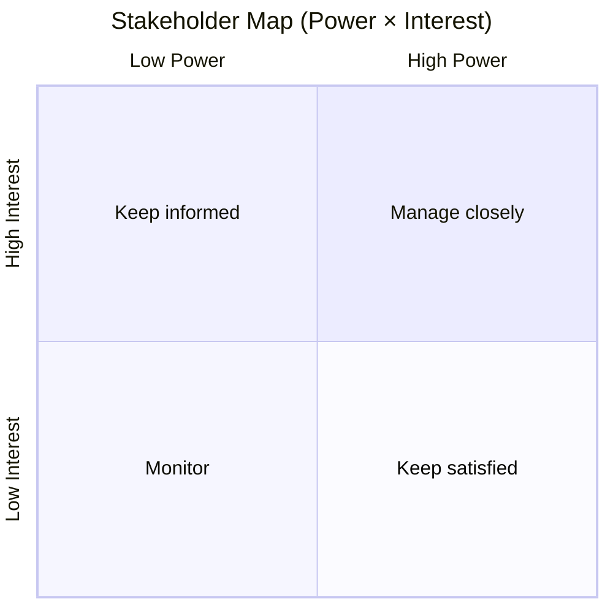

# DOC-02 — Phân tích stakeholder

| Phiên bản | Ngày | Tác giả | Trạng thái |
|-----------|------|---------|------------|
| 0.1 | 2026-08-07 | Hoàng | Draft |

**Tiêu chuẩn tham khảo:** Stakeholder register (PMBOK, BABOK); thường là phần của BRD hoặc Quality/Communication Plan.

---

## 1. Mục đích

Xác định các bên liên quan của dự án HRM Công ty ABC, mức ảnh hưởng/quan tâm và chiến lược quản lý để đảm bảo yêu cầu đúng người, đúng mức, đúng thời điểm. Sơ bộ cho phase discovery; sẽ bổ sung khi có danh sách người cụ thể từ ABC.

> **Ghi chú:** Người cụ thể (tên + vai trò thực tế tại ABC) **chưa được cung cấp** — bảng dưới dùng vai trò chức danh. Sponsor/Business Owner của ABC chưa xác định.

## 2. Đăng ký stakeholder

| ID | Stakeholder | Vai trò / Tổ chức | Quyền lợi | Mức ảnh hưởng | Mức quan tâm | Chiến lược |
|----|-------------|-------------------|-----------|---------------|--------------|------------|
| SH-001 | Sponsor ABC | Người quyết định, cấp ngân sách, chốt goal/ROI | Dự án thành công, tiết kiệm chi phí | H | H | Manage closely |
| SH-002 | Nhân viên | Người dùng: tạo đơn nghỉ, xem chấm công/lương, nhận cảnh báo | Thao tác đơn giản, đúng lương, minh bạch | L | H | Keep informed |
| SH-003 | Quản lý trực tiếp | Phê duyệt đơn nghỉ, xem báo cáo đội nhóm | Phê duyệt nhanh, thấy được biến động đội | M | H | Keep informed |
| SH-004 | HR | Quản lý hồ sơ, duyệt đơn, import chấm công, chốt lương, on/offboarding | Giảm thao tác tay, ít sai sót | H | H | Manage closely |
| SH-005 | Admin/IT | Cấu hình hệ thống, quản trị tài khoản | Hệ thống ổn định, dễ quản trị | H | L | Keep satisfied |
| SH-006 | Finance/Kế toán | Duyệt/chốt bảng lương, đối soát chi phí nhân sự | Lương đúng, đối soát nhanh | M | H | Keep informed |
| SH-007 | anh Hoàng | PM/BA/SA/DEV/DevOps (bên phát triển) | Bàn giao đúng yêu cầu, đúng kế hoạch | H | H | Manage closely |

**Legend ảnh hưởng / quan tâm:** High · Medium · Low

## 3. Bản đồ stakeholder (Quyền lực × Mức quan tâm)

| Quadrant | Stakeholder IDs |
|----------|-----------------|
| Manage closely | SH-001, SH-004, SH-007 |
| Keep satisfied | SH-005 |
| Keep informed | SH-002, SH-003, SH-006 |
| Monitor | — |

## 4. RACI (sơ bộ)

| Hoạt động / Deliverable | Sponsor | HR | Quản lý | Finance | Admin/IT | anh Hoàng |
|-------------------------|---------|----|----|----|----------|-----------|
| Chốt Goal + Success Criteria | A | C | — | — | — | R |
| Approve BRD (DOC-03) | A | C | C | C | — | R |
| Phê duyệt đơn nghỉ phép | — | A | R | — | — | — |
| Import chấm công | — | R | — | — | — | C |
| Chốt bảng lương | — | R | C | A | — | R |
| UAT sign-off | A | R | C | C | C | C |
| Quản trị hệ thống | — | I | I | I | A | C |

**R** = Responsible · **A** = Accountable · **C** = Consulted · **I** = Informed

## 5. Kế hoạch truyền thông (tóm tắt)

| Stakeholder | Nội dung | Tần suất | Kênh | Owner |
|-------------|----------|----------|------|-------|
| Sponsor ABC | Vision, ROI, baseline DOC-01–03 | Gate (khi chốt) | Workshop / email | anh Hoàng |
| HR | Yêu cầu nghiệp vụ, demo, UAT | Sprint / Gate | Workshop | anh Hoàng |
| Quản lý trực tiếp | Luồng phê duyệt, báo cáo | Gate | Email / demo | anh Hoàng |
| Finance/Kế toán | Công thức lương, BHXH/thuế, chốt lương | Gate | Email / workshop | anh Hoàng |
| Nhân viên | Hướng dẫn sử dụng, chính sách nghỉ/lương | Khi triển khai | Email / training | HR |
| Admin/IT | Cấu hình, deploy, vận hành | Sprint / Gate | Email / họp | anh Hoàng |

## 6. Giả định

| ID | Giả định |
|----|----------|
| SA-001 | Sponsor ABC là người duy nhất có quyền chốt goal + ROI; chưa xác định là ai |
| SA-002 | HR là người dùng chính (nhập hồ sơ, import chấm công, chốt lương) |
| SA-003 | Quy trình phê duyệt nghỉ: quản lý trực tiếp → HR (2 cấp) |
| SA-004 | Nhân viên dùng mobile nhiều hơn web; HR/Admin/Finance dùng web |
| SA-005 | Finance/Kế toán tham gia duyệt/chốt bảng lương trong hệ thống (DEC-DIS-007) |
| SA-006 | Vendor app chấm công thứ 3 là bên ngoài, cần xác nhận khả năng export excel (D-001) |
